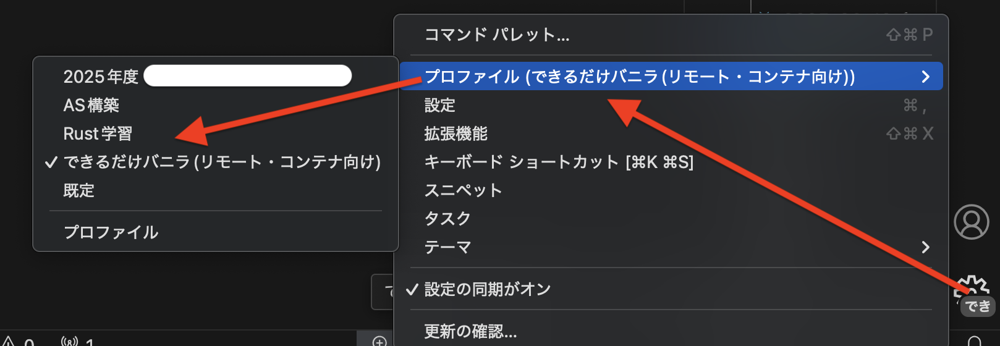
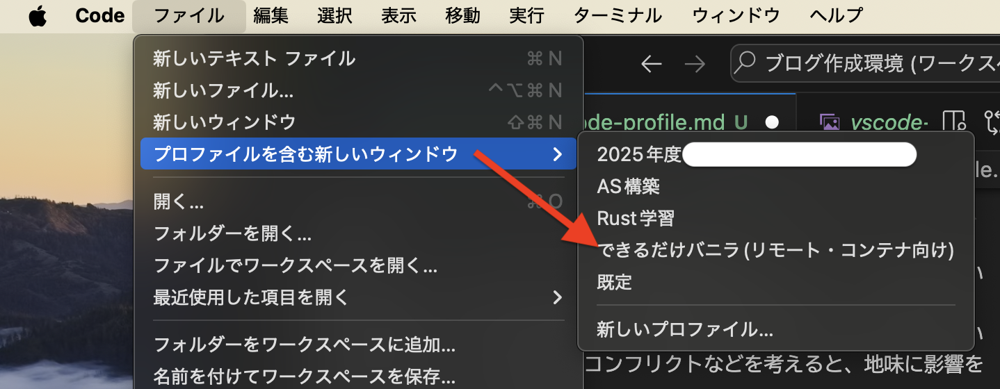

実は今までろくに気づいていなかったのでした。プロファイル機能…

<!--more-->

<a href="//af.moshimo.com/af/c/click?a_id=1175594&p_id=56&pc_id=56&pl_id=637&s_v=b5Rz2P0601xu&url=http%3A%2F%2Fbooks.rakuten.co.jp%2Frb%2F17877629%2F%3Frafcid%3Dwsc_b_bs_1051722217600006323" target="_blank" >プログラマーのためのVisual Studio Codeの教科書【改訂2版】</a>
posted with <a href="https://yomereba.com" rel="nofollow" target="_blank">ヨメレバ</a>

川崎 庸市/平岡 一成/阿佐 志保 マイナビ出版 2024年06月24日頃    

<a href="//af.moshimo.com/af/c/click?a_id=1175594&p_id=56&pc_id=56&pl_id=637&s_v=b5Rz2P0601xu&url=http%3A%2F%2Fbooks.rakuten.co.jp%2Frb%2F17877629%2F%3Frafcid%3Dwsc_b_bs_1051722217600006323" target="_blank" >楽天ブックス</a>

<a href="//af.moshimo.com/af/c/click?a_id=920708&p_id=170&pc_id=185&pl_id=4062&s_v=b5Rz2P0601xu&url=https%3A%2F%2Fwww.amazon.co.jp%2Fexec%2Fobidos%2FASIN%2F4839985316" target="_blank" >Amazon</a>

<a href="//af.moshimo.com/af/c/click?a_id=920708&p_id=170&pc_id=185&pl_id=4062&s_v=b5Rz2P0601xu&url=https%3A%2F%2Fwww.amazon.co.jp%2Fgp%2Fsearch%3Fkeywords%3D%25E3%2583%2597%25E3%2583%25AD%25E3%2582%25B0%25E3%2583%25A9%25E3%2583%259E%25E3%2583%25BC%25E3%2581%25AE%25E3%2581%259F%25E3%2582%2581%25E3%2581%25AEVisual%2520Studio%2520Code%25E3%2581%25AE%25E6%2595%2599%25E7%25A7%2591%25E6%259B%25B8%25E3%2580%2590%25E6%2594%25B9%25E8%25A8%25822%25E7%2589%2588%25E3%2580%2591%26__mk_ja_JP%3D%2583J%2583%255E%2583J%2583i%26url%3Dnode%253D2275256051" target="_blank" >Kindle</a>
                              	  	  	  	  	

VisualStudio Code(以下vscode)には「プロファイル」という機能があったことを皆さんご存じですか?
もしくは『覚えていましたか?』ということになるとおもいます。

vscodeでは、プロファイルという機能で、環境の切り分けがサポートされています。
環境というと、一番大きいのが拡張機能周りだと思いますが、『規程』というかなにも考えずに使っていると、拡張機能部取りを起こしてしまいます。それほど重くないし、力技でぶん回せるかもしれないので余り考えていないかも知れませんが、拡張機能のコンフリクトなどを考えると、地味に影響を受けそうな話です。

ということでプロファイル機能。呼び出し方は雑に2カ所あります。

- サイドバーの歯車アイコンで『プロファイルの切り替え』
    
- ファイルメニューの『プロファイルを含む新しいウィンドウ』
    

前者は既存の(今使用している)ウィンドウのプロファイルを切り替えますし、後者はこれから開くものを選択できます。
一度プロファイルを設定したウィンドウは、履歴に残っている限りは閉じたときのプロファイルを維持するようです。間違っても途中で切り替えれば再読み込みによりプロファイルが切り替わります。

なので、プログラミングや執筆に応じた環境をこちらから持てるようですので、サクサクとした挙動を維持するためにも最低限のプロファイルで軽く生きていくのがいいかもしれません。

---

それはそれとして、IntelliJのシリーズってすごくあるのですが、これらはシリーズを複数入れた場合(たとえばIntelliJ IDEAのProfessionalとRustRoverを入れた場合)、共通コンポーネント部分もそれぞれでインストールされて余計にストレージを喰っていないかとか地味に気になります。

できればIntelliJ+RustプラグインでRustRoverになるとかならわからなくもないのですが…どうも完全とは行ってないみたい。

